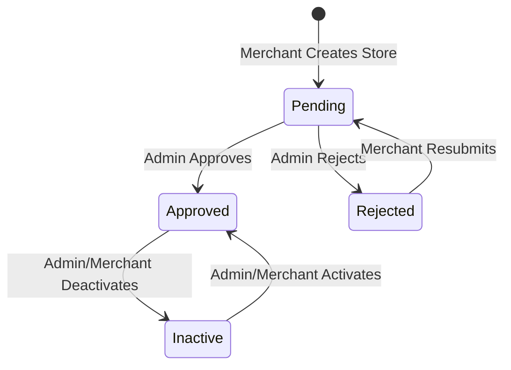

# Palverse Business Rules

This document outlines the core business rules and workflows that govern the Palverse platform's operations.

---

## 1. Store Lifecycle & Moderation

### Submission & Status Flow
New merchants/stores are **not** created by merchant self-registration.
Inbound creation paths only:
1. **Representative store-registration request** (submitted → admin/follow-up review → approve creates merchant + store).
2. **Public merchant join request** (submitted → admin/follow-up review → approve creates merchant + store + pending subscription).

Store listing statuses for an existing store:
1.  **Draft / Pending**: When a store awaits moderation it is not visible to the public.
2.  **Approved**: An Admin must review and approve the store. Once approved, the store becomes live (if active).
3.  **Rejected**: If a store fails to meet standards, an Admin rejects it. The store remains hidden, and the merchant is notified.
4.  **Active / Inactive**: Admins or Merchants can toggle the visibility. Even if approved, an inactive store is hidden from public browse/search.

---

## 2. Subscription Management (MVP)

*   **Manual Assignment**: MVP does not integrate electronic payment gateways. Subscriptions (e.g., Free, Basic, Premium) must be assigned, modified, or terminated manually by an Admin.
*   **Visibility Thresholds**: Access to premium options (such as advanced offers or custom gallery sizes) depends on the manual subscription status assigned to the store by the admin.
*   **Automatic Renewal**: Excluded in MVP (Phase 2). Subscriptions must have an explicit expiration date monitored by the system.

---

## 3. Bilingual Support (Arabic & English)

*   **RTL and LTR Compatibility**: Both the web application and the mobile application must gracefully transition between Arabic (Right-to-Left) and English (Left-to-Right) layouts.
*   **Data Translation**: Core content fields (such as Category names, City names, and Store descriptions) must support translation inputs in the database to prevent untranslated fallbacks.

---

## 4. Geographic Hierarchy

*   **Cities and Zones**: Store locations are organized hierarchically:
    $$\text{Zone} \subset \text{City}$$
    A city contains multiple sub-zones (e.g., City: *Ramallah*, Zones: *Al-Masyoun*, *Al-Bireh*).
*   **Coordinates**: Each store must specify exact Latitude and Longitude coordinates within its selected Zone for Google Maps placement and directions.

---

## 5. Security & Role-Based Access Control (RBAC)

The system distinguishes between three distinct user roles:
1.  **Admin**: Full access to dashboard parameters, content moderation, category configurations, user management, and manual subscription updates.
2.  **Merchant**: Can manage only the stores they own. They cannot access other merchants' stores or any administrative controls.
3.  **Guest / Public**: Can browse stores, search, view offers, and download QR codes without authentication.

---

## 6. Store Slugs & QR Codes

*   **Unique Permanent URLs**: Every store must have a unique URL slug based on its name (e.g., `/store/al-yasmin-supermarket`). Once approved, this slug should not change without administrative approval to preserve SEO value and QR code consistency.
*   **QR Code Validity**: The generated QR code points to the permanent store URL. If the store is deleted or deactivated, the QR code must resolve to a clean "Store Currently Unavailable" page.
