# Palverse Entity Relationship Diagram (ERD)

This document provides the database design, relationship specifications, and cardinality rules for the Palverse Minimum Viable Product (MVP).

---

## 1. Database Architecture Overview

Palverse uses a MySQL relational database. The database is designed for optimal performance, data integrity, and strict security compliance. It enforces:
*   **Foreign Key Integrity**: All entity relations are strictly bound by MySQL foreign keys, using `RESTRICT` or `CASCADE` behaviors where appropriate to prevent orphaned records.
*   **Security & ID Obfuscation**: Auto-incrementing integer IDs (`id`) are restricted to internal database joins. For public routing and APIs, unique natural keys (e.g., URL `slug` for stores) or global unique identifiers (`uuid` for users and offers) are exposed.
*   **Translation Mapping**: Instead of complex JSON payloads or relational translations tables, the system uses dual-language columns (e.g., `name_ar` and `name_en`) directly within tables to preserve SQL index performance.

---

## 2. Mermaid ER Diagram

```mermaid
erDiagram
    USERS ||--o{ MODEL_HAS_ROLES : "has roles"
    ROLES ||--o{ MODEL_HAS_ROLES : "assigns role"
    USERS {
        uint id PK
        uuid uuid UK
        string name
        string email UK
        string password
        timestamp email_verified_at
        string remember_token
        timestamp created_at
        timestamp updated_at
        timestamp deleted_at
    }
    
    ROLES {
        uint id PK
        string name UK
        string guard_name
        timestamp created_at
        timestamp updated_at
    }
    
    ROLES ||--o{ ROLE_HAS_PERMISSIONS : "has permissions"
    PERMISSIONS ||--o{ ROLE_HAS_PERMISSIONS : "assigns permission"
    PERMISSIONS {
        uint id PK
        string name UK
        string guard_name
        timestamp created_at
        timestamp updated_at
    }

    MODEL_HAS_ROLES {
        uint role_id FK
        string model_type
        uint model_id FK
    }

    ROLE_HAS_PERMISSIONS {
        uint permission_id FK
        uint role_id FK
    }

    CITIES ||--o{ ZONES : "contains"
    CITIES {
        uint id PK
        string name_ar UK
        string name_en UK
        timestamp created_at
        timestamp updated_at
    }

    ZONES {
        uint id PK
        uint city_id FK
        string name_ar
        string name_en
        timestamp created_at
        timestamp updated_at
    }

    CATEGORIES ||--o{ STORES : "classifies"
    CATEGORIES {
        uint id PK
        string name_ar UK
        string name_en UK
        string slug UK
        timestamp created_at
        timestamp updated_at
    }

    STORES {
        uint id PK
        uuid uuid UK
        uint owner_id FK "users.id"
        uint category_id FK "categories.id"
        uint zone_id FK "zones.id"
        string name_ar
        string name_en
        string slug UK
        string description_ar
        string description_en
        string status "enum(pending, approved, rejected)"
        boolean is_active
        decimal latitude
        decimal longitude
        timestamp created_at
        timestamp updated_at
        timestamp deleted_at
    }

    STORES ||--o{ STORE_SOCIAL_LINKS : "owns"
    STORE_SOCIAL_LINKS {
        uint id PK
        ulid public_id UK
        uint store_id FK "stores.id"
        string platform
        string url
        string username
        uint sort_order
        boolean is_active
        timestamp created_at
        timestamp updated_at
        timestamp deleted_at
    }

    STORES ||--o{ STORE_WORKING_HOURS : "operates"
    STORE_WORKING_HOURS {
        uint id PK
        ulid public_id UK
        uint store_id FK "stores.id"
        tinyint day_of_week "0=Sunday..6=Saturday"
        tinyint period_index
        time opens_at
        time closes_at
        boolean is_closed
        timestamp created_at
        timestamp updated_at
    }

    STORES ||--o{ STORE_MEDIA : "holds"
    STORE_MEDIA {
        uint id PK
        ulid public_id UK
        uint store_id FK "stores.id"
        string type "enum(logo, cover, gallery)"
        string file_path
        string disk
        string original_name
        string mime_type
        uint file_size
        uint width
        uint height
        uint sort_order
        string alt_text_ar
        string alt_text_en
        timestamp created_at
        timestamp updated_at
        timestamp deleted_at
    }

    STORES ||--o{ OFFERS : "promotes"
    OFFERS {
        uint id PK
        ulid public_id UK
        uint store_id FK "stores.id"
        string title_ar
        string title_en
        text description_ar
        text description_en
        decimal price
        decimal old_price
        string currency "ILS"
        string image_path
        string image_disk
        datetime starts_at
        datetime ends_at
        boolean is_active
        uint sort_order
        timestamp created_at
        timestamp updated_at
        timestamp deleted_at
    }

    SUBSCRIPTION_PLANS ||--o{ STORE_SUBSCRIPTIONS : "defines"
    SUBSCRIPTION_PLANS {
        uint id PK
        string code UK
        string name_ar
        string name_en
        text description_ar
        text description_en
        decimal price
        string currency "ILS"
        uint duration_days
        uint max_offers
        uint max_gallery_images
        boolean is_active
        uint sort_order
        timestamp created_at
        timestamp updated_at
        timestamp deleted_at
    }

    STORES ||--o{ STORE_SUBSCRIPTIONS : "subscribes"
    STORE_SUBSCRIPTIONS {
        uint id PK
        ulid public_id UK
        uint store_id FK "stores.id"
        uint subscription_plan_id FK "subscription_plans.id"
        string status "enum(pending, active, expired, cancelled)"
        datetime starts_at
        datetime ends_at
        decimal price_snapshot
        string currency_snapshot "ILS"
        string plan_name_ar_snapshot
        string plan_name_en_snapshot
        timestamp created_at
        timestamp updated_at
    }

    STORES ||--o{ STORE_STATUS_HISTORY : "tracks status"
    STORE_STATUS_HISTORY {
        uint id PK
        uint store_id FK "stores.id"
        uint admin_id FK "users.id"
        string old_status
        string new_status
        timestamp created_at
    }

    STORES ||--o{ STORE_REJECTION_REASONS : "rejection logs"
    STORE_REJECTION_REASONS {
        uint id PK
        uint store_id FK "stores.id"
        uint admin_id FK "users.id"
        text reason
        timestamp created_at
    }

    SYSTEM_SETTINGS {
        uint id PK
        ulid public_id UK
        string group
        string key
        text value
        string type
        boolean is_public
        string description_ar
        string description_en
    }

    STATIC_PAGES {
        uint id PK
        ulid public_id UK
        string slug UK
        string title_ar
        string title_en
        text content_ar
        text content_en
        boolean is_published
        datetime published_at
        uint sort_order
    }

    FAQS {
        uint id PK
        ulid public_id UK
        string question_ar
        string question_en
        text answer_ar
        text answer_en
        string category
        boolean is_active
        uint sort_order
    }
```

---

## 3. Description of Relationships & Cardinality

1.  **Users & Roles (M:N)**: A user can be assigned roles via `model_has_roles`.
2.  **Cities & Zones (1:N)**: A city can contain many zones, but a zone belongs to exactly one city. Cardinality: $\text{Zone} \subset \text{City}$.
3.  **Categories & Stores (1:N)**: A category can classify multiple stores, but a store has exactly one primary category configuration.
4.  **Users (Owner) & Stores (1:N)**: A user (merchant) can own one or more stores, but each store belongs to exactly one primary owner.
5.  **Stores & Working Hours (1:N)**: A store has up to 7 working hours entries (one per day of the week).
6.  **Stores & Media (1:N)**: A store owns many media records. Validation rules constrain this to: exactly 1 active logo, exactly 1 active cover, and $\le 10$ gallery images.
7.  **Stores & Offers (1:N)**: A store can post multiple offers.
8.  **Stores & Subscriptions (1:N)**: A store can have multiple subscription logs (historical records), but only one active subscription range determines its public visibility.
9.  **Subscription Plans & Subscriptions (1:N)**: A subscription plan defines the pricing and duration terms for multiple manual subscriptions.
10. **Stores & Rejection Reasons (1:N)**: A store can have multiple rejection reason records (rejection history).

---

## 4. Ownership and Authorization Boundaries

*   **Merchant Scope Boundary**: Authenticated merchants are query-restricted by matching `stores.owner_id == authenticated_user_id`. Any actions altering `store_working_hours`, `store_social_links`, `store_media`, or `offers` must perform an ownership validation check on the parent store before executing writes.
*   **Admin Scope Boundary**: Administrators override ownership checks. They are the sole writers for the `subscription_plans`, `subscriptions`, `cities`, `zones`, `categories`, `settings`, `store_status_history`, and `store_rejection_reasons` tables.

---

## 5. MVP vs. Phase 2 Tables

### MVP Core Tables (Included in active schema)
*   `users`, `roles`, `permissions`
*   `stores`, `categories`, `cities`, `zones`
*   `store_media`, `store_working_hours`, `store_social_links`
*   `offers`, `subscription_plans`, `subscriptions`
*   `system_settings`, `static_pages`, `faqs`
*   `store_status_history`, `store_rejection_reasons`

### Phase 2 Tables (Excluded from MVP database)
*   `representative_assignments` (Sales Representative territory logs)
*   `commissions` (Representative onboarding payouts logs)
*   `cash_collections` (Cash payment logs)
*   `digital_receipts` (Receipt validation keys)
*   `rejection_surveys` (Merchant feedback logs)
*   `crm_logs` (Follow-up calls logs)
*   `payment_transactions` (Gateway logs for automatic checkout)

---

## 6. Audit-Sensitive Tables
The following tables are subject to audit logs or status histories to prevent security fraud and track system adjustments:
*   **`subscriptions`**: Modifying expiration dates or plan associations shifts financial status.
*   **`store_status_history`**: Tracks moderation steps (who changed which store status and when).
*   **`store_rejection_reasons`**: Legal record of why a merchant storefront was rejected.

---

## 7. Unresolved Database Decisions
1.  **Multiple Categories**: Whether stores will need to support multiple secondary categories in future releases. (MVP implements a simple 1-to-many relationship mapping).
2.  **Coordinates Precision**: Whether to use MySQL's native `POINT` spatial datatype for geolocated coordinates or stick to high-precision `decimal(10, 8)` to ease framework queries. (MVP implements `decimal(10, 8)` for standard compatibility).
