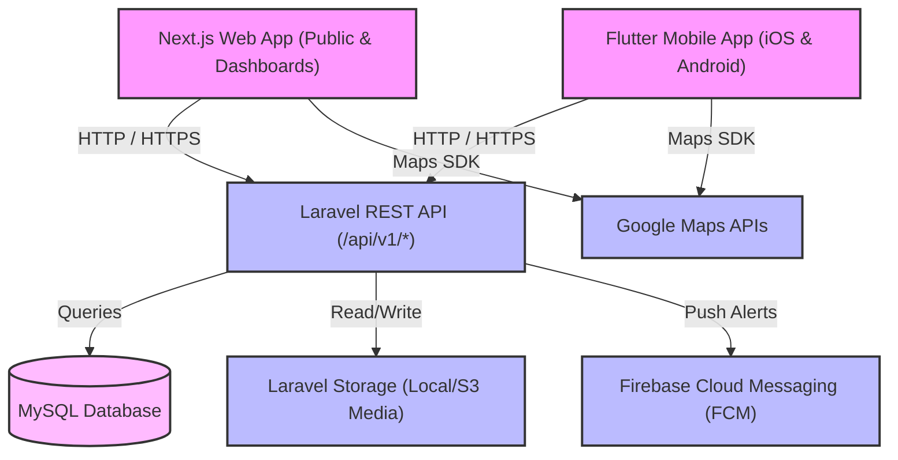

# Palverse System Architecture

This document describes the high-level system architecture, components, data flow, and technical stack of the Palverse platform.

## High-Level Architecture Overview

Palverse uses a classic Client-Server architecture. The backend acts as a stateless REST API, exposing endpoints for both the Next.js web application and the Flutter mobile application.

---

## 1. Backend: Laravel REST API (`palverse-api`)
The backend is a Laravel application providing a secure, stateless JSON REST API.

*   **API Versioning**: All endpoints are prefixed with `/api/v1/` to ensure backward compatibility and clean versioning.
*   **Authentication & Session Management**: Powered by **Laravel Sanctum**. Sanctum issues API tokens for mobile clients and uses cookie-based sessions for web dashboard requests.
*   **Request Validation**: Enforced using Laravel's **Form Requests**.
*   **Response Formatting**: Standardized using **API Resources** to ensure consistent JSON formats and fields mapping.
*   **Authorization**: Controlled via Laravel **Policies** mapped to models, supporting Role-Based Access Control (RBAC) (Admin, Merchant, Public/Guest).
*   **Database Engine**: **MySQL** for relational persistence.
*   **Storage**: Handled using **Laravel Storage Abstraction** for store logos, covers, and gallery media.
*   **Soft Deletes**: Enabled on crucial entities like stores, users, and offers to prevent accidental data loss.

---

## 2. Frontend: Next.js Web Application (`palverse-web`)
The web application serves both public visitors and administrators/merchants for dashboard actions.

*   **Framework**: **Next.js** (App Router) with **TypeScript**.
*   **Structure Separation**:
    *   `app/(public)`: Public routes for store browsing, category view, searching, store profiles, and offers.
    *   `app/(auth)`: Shared authentication routes (login, register).
    *   `app/(dashboard)/admin`: Administrative control panels.
    *   `app/(dashboard)/merchant`: Merchant storefront panels.
*   **Internationalization (i18n)**: Native Support for Arabic (RTL) and English (LTR) dynamically determined by route context or user settings.
*   **UI/UX**: Responsive Vanilla CSS for maximum styling control, leveraging a strict design system (colors, typography, transitions) to provide a premium feel.

---

## 3. Mobile Client: Flutter Application (`palverse-mobile`)
The mobile application targets iOS and Android devices, primarily targeting public users browsing stores and merchants managing their storefronts.

*   **Structure**: Feature-First project structure.
*   **State Management**: **Riverpod** for robust, testable state tracking.
*   **HTTP Client**: **Dio** configured with interceptors for attaching Sanctum authorization tokens, logging, and error handling.
*   **Navigation**: **GoRouter** for declarative routing.
*   **Localization**: Built-in RTL/LTR layouts matching the phone system language or user preference (Arabic/English).
*   **Core Integrations**:
    *   **Google Maps SDK**: Displays store location pins and navigates users to stores.
    *   **Firebase Cloud Messaging (FCM)**: Receives real-time push alerts from the backend.
