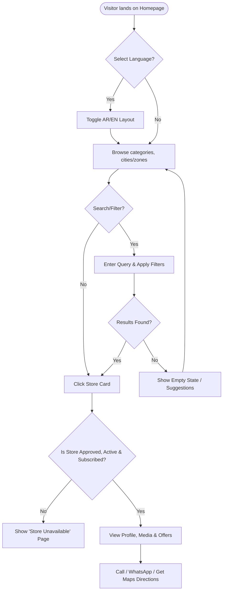
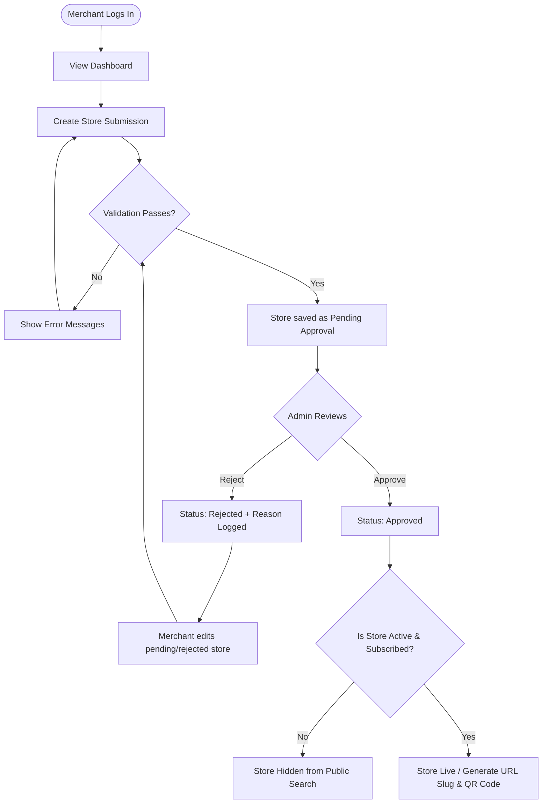
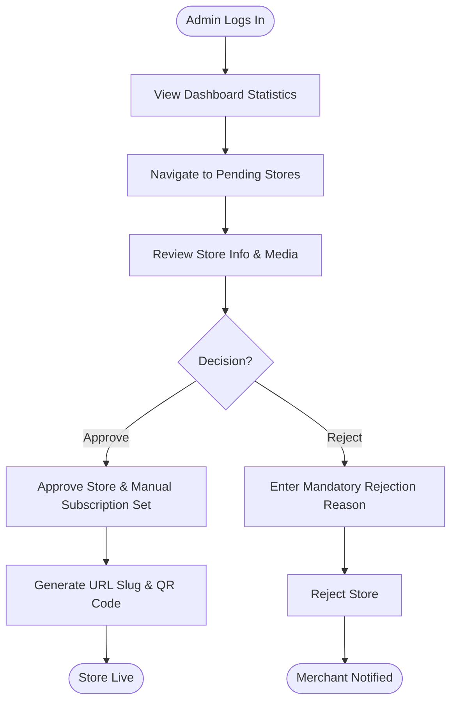
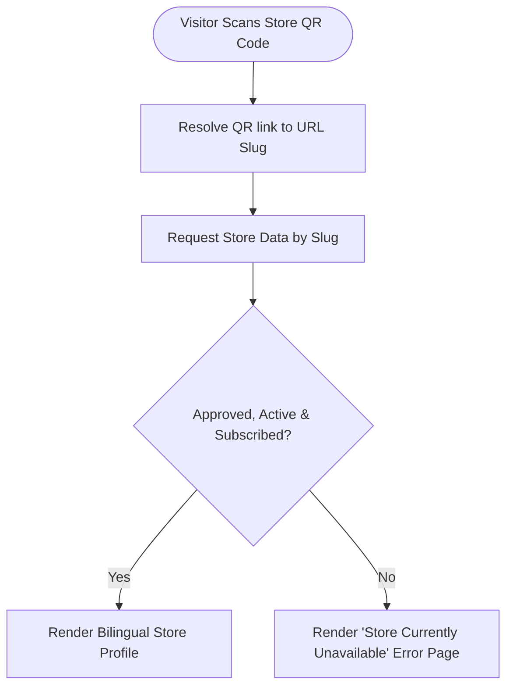

# Palverse User Flows

This document details the user flows for the Palverse platform Minimum Viable Product (MVP), including public visitors, merchants, and administrators. It also provides simplified summaries of future Phase 2 flows.

---

## Part 1: Mermaid Diagrams

### 1. Public Store Discovery Flow

### 2. Merchant Store Submission and Approval Flow

### 3. Administrator Store Approval Flow

### 4. QR Code Store Access Flow

---

## Part 2: Public Visitor Flows

### PV-01: Select Language
*   **Flow ID**: PV-01
*   **Actor**: Public Visitor
*   **Goal**: Toggle the platform language between Arabic and English.
*   **Preconditions**: Platform is loaded.
*   **Entry point**: Header language switcher button.
*   **Main success path**:
    1. Visitor clicks the language toggle (e.g., "English" or "العربية").
    2. Interface switches layout (LTR for English, RTL for Arabic).
    3. Static UI texts reload in the chosen language.
*   **Alternative paths**: None.
*   **Error paths**: Switcher fails to load localization dictionaries; defaults to Arabic.
*   **Authorization requirements**: None (Public).
*   **Final state**: App displayed in selected language.
*   **Related business rules**: Bilingual Support (RTL/LTR).
*   **MVP or Phase 2 classification**: MVP.

### PV-02: Browse Home Page
*   **Flow ID**: PV-02
*   **Actor**: Public Visitor
*   **Goal**: View the platform homepage and discover featured content.
*   **Preconditions**: Platform is loaded.
*   **Entry point**: Root URL (e.g., `/`).
*   **Main success path**:
    1. Visitor views categories, recent promotions/offers, and search bar.
*   **Alternative paths**: None.
*   **Error paths**: Connection timeout; show network error screen.
*   **Authorization requirements**: None.
*   **Final state**: Homepage displayed successfully.
*   **Related business rules**: Only approved, active stores with a valid subscription appear publicly.
*   **MVP or Phase 2 classification**: MVP.

### PV-03: Browse Categories
*   **Flow ID**: PV-03
*   **Actor**: Public Visitor
*   **Goal**: View list of stores belonging to a specific business category.
*   **Preconditions**: Home page or browse page is loaded.
*   **Entry point**: Category grid/slider.
*   **Main success path**:
    1. Visitor clicks a category (e.g., "Restaurants").
    2. App queries stores associated with the selected category.
    3. Store listing matching the category is displayed.
*   **Alternative paths**: No stores belong to this category; show "No stores found" page.
*   **Error paths**: Category list fails to fetch; show retry button.
*   **Authorization requirements**: None.
*   **Final state**: Category store listing displayed.
*   **Related business rules**: Bilingual content for category titles.
*   **MVP or Phase 2 classification**: MVP.

### PV-04: Browse Cities and Zones
*   **Flow ID**: PV-04
*   **Actor**: Public Visitor
*   **Goal**: View list of stores in a particular city or zone.
*   **Preconditions**: Search/Browse page is loaded.
*   **Entry point**: City/Zone dropdown selector.
*   **Main success path**:
    1. Visitor selects a City (e.g., "Ramallah").
    2. Optionally, visitor selects a Zone (e.g., "Al-Masyoun").
    3. Directory displays filtered list of active stores in the selected zone.
*   **Alternative paths**: Visitor selects "All Zones" to view all stores in the city.
*   **Error paths**: Location hierarchy fails to load; show error notification.
*   **Authorization requirements**: None.
*   **Final state**: Geographical store listings loaded.
*   **Related business rules**: Geographic Hierarchy ($\text{Zone} \subset \text{City}$).
*   **MVP or Phase 2 classification**: MVP.

### PV-05: Search for Stores
*   **Flow ID**: PV-05
*   **Actor**: Public Visitor
*   **Goal**: Find stores by keyword search.
*   **Preconditions**: Home or browse page is loaded.
*   **Entry point**: Global Search Bar.
*   **Main success path**:
    1. Visitor enters keywords (e.g., "Bakery") and hits Search.
    2. Search query is matched against store name, tags, and description.
    3. Results are displayed.
*   **Alternative paths**: Search results are empty (refer to PV-16).
*   **Error paths**: Search query fails due to server error; display error message.
*   **Authorization requirements**: None.
*   **Final state**: Matching stores listed.
*   **Related business rules**: Only approved, active stores with valid subscriptions are returned.
*   **MVP or Phase 2 classification**: MVP.

### PV-06: Filter Search Results
*   **Flow ID**: PV-06
*   **Actor**: Public Visitor
*   **Goal**: Refine store lists using search filters.
*   **Preconditions**: Store listings are displayed.
*   **Entry point**: Filter panel icon.
*   **Main success path**:
    1. Visitor selects category, city, and/or zone filters.
    2. Results list updates dynamically without reloading the entire page.
*   **Alternative paths**: Visitor clears all filters; list returns to unfiltered state.
*   **Error paths**: None.
*   **Authorization requirements**: None.
*   **Final state**: Refined list of stores displayed.
*   **Related business rules**: None.
*   **MVP or Phase 2 classification**: MVP.

### PV-07: Open Store Profile
*   **Flow ID**: PV-07
*   **Actor**: Public Visitor
*   **Goal**: View the complete storefront details of a business.
*   **Preconditions**: Store list or direct link is accessed.
*   **Entry point**: Store card click or URL slug.
*   **Main success path**:
    1. Visitor clicks a store card.
    2. System resolves store details, logo, cover image, gallery, working hours, and contact details.
    3. Profiles load cleanly in the user's current interface language.
*   **Alternative paths**: None.
*   **Error paths**: Store does not exist (404 page) or is inactive (refer to PV-15).
*   **Authorization requirements**: None.
*   **Final state**: Store profile displayed.
*   **Related business rules**: Store validation, unique URL slugs.
*   **MVP or Phase 2 classification**: MVP.

### PV-08: View Contact and Social Information
*   **Flow ID**: PV-08
*   **Actor**: Public Visitor
*   **Goal**: View contact channels for the store.
*   **Preconditions**: Store profile is open (PV-07).
*   **Entry point**: Store profile contact section.
*   **Main success path**:
    1. Visitor views phone number, WhatsApp number, website link, and social media handles.
*   **Alternative paths**: None.
*   **Error paths**: Contact info not configured; section is hidden.
*   **Authorization requirements**: None.
*   **Final state**: Information visible to visitor.
*   **Related business rules**: Configure contacts.
*   **MVP or Phase 2 classification**: MVP.

### PV-09: Call Store
*   **Flow ID**: PV-09
*   **Actor**: Public Visitor
*   **Goal**: Dial the store's telephone or mobile number.
*   **Preconditions**: Store profile is open (PV-07).
*   **Entry point**: "Call Now" button.
*   **Main success path**:
    1. Visitor clicks the "Call Now" button.
    2. Device triggers native dialer with pre-filled phone number.
*   **Alternative paths**: Multiple phone numbers available; system displays picker sheet.
*   **Error paths**: Number is empty/broken; show "Phone number not available" alert.
*   **Authorization requirements**: None.
*   **Final state**: Native phone dialer opened.
*   **Related business rules**: Phone number validation.
*   **MVP or Phase 2 classification**: MVP.

### PV-10: Open WhatsApp
*   **Flow ID**: PV-10
*   **Actor**: Public Visitor
*   **Goal**: Open a WhatsApp chat window with the merchant.
*   **Preconditions**: Store profile is open (PV-07) and has a WhatsApp number.
*   **Entry point**: "WhatsApp" icon/button.
*   **Main success path**:
    1. Visitor clicks the WhatsApp button.
    2. Device launches WhatsApp app (or web URL) targetting the store's phone number with an optional pre-filled greeting.
*   **Alternative paths**: WhatsApp is not installed; fall back to browser WhatsApp web.
*   **Error paths**: WhatsApp link configuration error; show error alert.
*   **Authorization requirements**: None.
*   **Final state**: WhatsApp chat opened.
*   **Related business rules**: Valid phone format.
*   **MVP or Phase 2 classification**: MVP.

### PV-11: Open Google Maps Directions
*   **Flow ID**: PV-11
*   **Actor**: Public Visitor
*   **Goal**: Launch navigation to the store location.
*   **Preconditions**: Store profile is open and has valid coordinates.
*   **Entry point**: "Get Directions" button or map preview.
*   **Main success path**:
    1. Visitor clicks the directions action.
    2. Google Maps app launches with the destination coordinates set to the store.
*   **Alternative paths**: Fallback to browser Google Maps page if native app is absent.
*   **Error paths**: Coordinates are invalid/missing; button disabled or shows error alert.
*   **Authorization requirements**: None.
*   **Final state**: Navigation launched.
*   **Related business rules**: Coordinates mandatory for maps.
*   **MVP or Phase 2 classification**: MVP.

### PV-12: View Store Offers
*   **Flow ID**: PV-12
*   **Actor**: Public Visitor
*   **Goal**: Check active promotions for the selected store.
*   **Preconditions**: Store profile is open (PV-07).
*   **Entry point**: "Offers" tab/section on the store profile.
*   **Main success path**:
    1. Visitor views active coupons, discounts, or announcements.
*   **Alternative paths**: Store has no active offers; section displays "No offers currently available".
*   **Error paths**: Offers fail to load; show reload option.
*   **Authorization requirements**: None.
*   **Final state**: List of active offers displayed.
*   **Related business rules**: Offers must be within start/end dates.
*   **MVP or Phase 2 classification**: MVP.

### PV-13: Share Store Page
*   **Flow ID**: PV-13
*   **Actor**: Public Visitor
*   **Goal**: Copy or send the permanent store URL.
*   **Preconditions**: Store profile is open (PV-07).
*   **Entry point**: "Share" icon.
*   **Main success path**:
    1. Visitor clicks Share.
    2. Native sharing dialog opens (mobile) or URL is copied to clipboard (web).
*   **Alternative paths**: None.
*   **Error paths**: Clipboard write fails; display manual URL copy input.
*   **Authorization requirements**: None.
*   **Final state**: URL shared or copied.
*   **Related business rules**: Permanent URL slug integrity.
*   **MVP or Phase 2 classification**: MVP.

### PV-14: Open Store Page using QR Code
*   **Flow ID**: PV-14
*   **Actor**: Public Visitor
*   **Goal**: Scan a printed QR code to load the store profile.
*   **Preconditions**: Printable QR code is available.
*   **Entry point**: Scanning QR code using a mobile camera/scanner.
*   **Main success path**:
    1. Visitor scans the QR code.
    2. URL resolves to the permanent store slug.
    3. Browser or App opens the corresponding Store Profile (PV-07).
*   **Alternative paths**: Scanning inside the app opens the page in-app.
*   **Error paths**: QR URL points to a deleted store (refer to PV-15).
*   **Authorization requirements**: None.
*   **Final state**: Store profile loaded successfully.
*   **Related business rules**: QR codes point to permanent store URLs.
*   **MVP or Phase 2 classification**: MVP.

### PV-15: Handle Inactive or Expired Store Page
*   **Flow ID**: PV-15
*   **Actor**: Public Visitor
*   **Goal**: Gracefully handle requests for stores that are inactive, expired, or rejected.
*   **Preconditions**: Target store slug is requested but the store is not public-ready.
*   **Entry point**: Direct URL access or QR scan.
*   **Main success path**:
    1. Visitor requests a store that is inactive/expired.
    2. System intercepts routing.
    3. System renders a clear, bilingual "Store Currently Unavailable" status page instead of a generic database error.
*   **Alternative paths**: None.
*   **Error paths**: None.
*   **Authorization requirements**: None.
*   **Final state**: Error/Unavailable state screen rendered.
*   **Related business rules**: Only approved, active, subscribed stores appear publicly.
*   **MVP or Phase 2 classification**: MVP.

### PV-16: Handle No Search Results
*   **Flow ID**: PV-16
*   **Actor**: Public Visitor
*   **Goal**: Render an empty search state.
*   **Preconditions**: Search query returned 0 matches.
*   **Entry point**: Search results screen.
*   **Main success path**:
    1. Visitor enters search text with no matches.
    2. Screen displays a custom "No stores found matching your search" message.
    3. Offers options to reset filters or try search suggestions.
*   **Alternative paths**: None.
*   **Error paths**: None.
*   **Authorization requirements**: None.
*   **Final state**: Search page shows empty-state guidelines.
*   **Related business rules**: None.
*   **MVP or Phase 2 classification**: MVP.

---

## Part 3: Merchant Flows

### ME-01: Merchant Login
*   **Flow ID**: ME-01
*   **Actor**: Merchant
*   **Goal**: Authenticate into the merchant panel.
*   **Preconditions**: Account is registered.
*   **Entry point**: Login portal (`/login`).
*   **Main success path**:
    1. Merchant inputs email/password.
    2. System verifies credentials.
    3. Sanitized session token is issued via Sanctum.
    4. Merchant is routed to the merchant dashboard.
*   **Alternative paths**: Password reset flow.
*   **Error paths**: Invalid credentials; display validation messages.
*   **Authorization requirements**: Guest.
*   **Final state**: Session active; merchant dashboard open.
*   **Related business rules**: Validate input, Sanctum tokens.
*   **MVP or Phase 2 classification**: MVP.

### ME-02: Logout
*   **Flow ID**: ME-02
*   **Actor**: Merchant
*   **Goal**: Revoke active session and log out.
*   **Preconditions**: Merchant is logged in.
*   **Entry point**: Dashboard header logout button.
*   **Main success path**:
    1. Merchant clicks "Logout".
    2. Sanctum API token is revoked from database.
    3. Local cookies/tokens are cleared.
    4. Redirected to public homepage.
*   **Alternative paths**: None.
*   **Error paths**: Network failure; local tokens are cleared anyway for security.
*   **Authorization requirements**: Authenticated Merchant.
*   **Final state**: Session invalidated.
*   **Related business rules**: Sanctum session invalidation.
*   **MVP or Phase 2 classification**: MVP.

### ME-03: View Merchant Dashboard
*   **Flow ID**: ME-03
*   **Actor**: Merchant
*   **Goal**: View summary statistics and listing status.
*   **Preconditions**: Authenticated Merchant.
*   **Entry point**: Dashboard landing page (`/dashboard`).
*   **Main success path**:
    1. Merchant views store statuses, subscription status, and quick shortcuts.
*   **Alternative paths**: None.
*   **Error paths**: Dashboard data fails to fetch; load cached layout with retry button.
*   **Authorization requirements**: Authenticated Merchant.
*   **Final state**: Dashboard summary rendered.
*   **Related business rules**: RBAC restrictions.
*   **MVP or Phase 2 classification**: MVP.

### ME-04: View Owned Stores
*   **Flow ID**: ME-04
*   **Actor**: Merchant
*   **Goal**: View list of stores associated with their account.
*   **Preconditions**: Authenticated Merchant.
*   **Entry point**: "My Stores" menu.
*   **Main success path**:
    1. Merchant retrieves store listings.
    2. System displays names, approval status, and subscription state of owned stores.
*   **Alternative paths**: Merchant owns no stores; display "Create Store" button.
*   **Error paths**: Data query failure; display error list.
*   **Authorization requirements**: Authenticated Merchant.
*   **Final state**: Owned stores listed.
*   **Related business rules**: Merchant may only manage stores they own.
*   **MVP or Phase 2 classification**: MVP.

### ME-05: Create a Store Submission
*   **Flow ID**: ME-05
*   **Actor**: Merchant
*   **Goal**: Submit a new store to the platform directory.
*   **Preconditions**: Authenticated Merchant.
*   **Entry point**: "Add New Store" button.
*   **Main success path**:
    1. Merchant fills in store details (Arabic mandatory, English optional).
    2. System performs validation checks.
    3. Store is saved in `Pending Approval` status.
*   **Alternative paths**: None.
*   **Error paths**: Validation failure (missing required fields); display input highlights.
*   **Authorization requirements**: Authenticated Merchant.
*   **Final state**: Store created with `Pending Approval` status.
*   **Related business rules**: New stores start as pending; Arabic content required.
*   **MVP or Phase 2 classification**: MVP.

### ME-06: Edit a Pending Store Submission
*   **Flow ID**: ME-06
*   **Actor**: Merchant
*   **Goal**: Modify a store details while it is pending review.
*   **Preconditions**: Authenticated Merchant, store status is `Pending Approval`.
*   **Entry point**: Edit button on pending store card.
*   **Main success path**:
    1. Merchant edits input fields.
    2. System validates and saves updates.
    3. Store remains in `Pending Approval` status for review.
*   **Alternative paths**: None.
*   **Error paths**: Validation failures.
*   **Authorization requirements**: Authenticated Merchant (Owner).
*   **Final state**: Pending store details updated.
*   **Related business rules**: Merchant may only manage owned stores.
*   **MVP or Phase 2 classification**: MVP.

### ME-07: View Approval Status
*   **Flow ID**: ME-07
*   **Actor**: Merchant
*   **Goal**: View the current moderation status of their stores.
*   **Preconditions**: Authenticated Merchant.
*   **Entry point**: Store status badge.
*   **Main success path**:
    1. Merchant views state: Pending, Approved, or Rejected.
*   **Alternative paths**: None.
*   **Error paths**: None.
*   **Authorization requirements**: Authenticated Merchant (Owner).
*   **Final state**: Status visible.
*   **Related business rules**: None.
*   **MVP or Phase 2 classification**: MVP.

### ME-08: View Rejection Reason
*   **Flow ID**: ME-08
*   **Actor**: Merchant
*   **Goal**: Check why a store submission was rejected by an admin.
*   **Preconditions**: Store status is `Rejected`.
*   **Entry point**: Rejected store details page.
*   **Main success path**:
    1. Merchant opens the rejected store card.
    2. System displays the rejection reason entered by the administrator.
*   **Alternative paths**: None.
*   **Error paths**: Rejection reason field is missing; show generic "Please contact administrator".
*   **Authorization requirements**: Authenticated Merchant (Owner).
*   **Final state**: Rejection reason visible.
*   **Related business rules**: Store rejection requires a reason.
*   **MVP or Phase 2 classification**: MVP.

### ME-09: Update Approved Store Information
*   **Flow ID**: ME-09
*   **Actor**: Merchant
*   **Goal**: Update store text or settings after approval.
*   **Preconditions**: Store status is `Approved`.
*   **Entry point**: Edit button on approved store profile.
*   **Main success path**:
    1. Merchant edits fields (except permanent slug).
    2. System validates input.
    3. Changes saved. Store status is reverted to `Pending Approval` for re-moderation (or direct update if admin config allows direct minor edits).
*   **Alternative paths**: Revert to draft if critical details are changed.
*   **Error paths**: Validation failure.
*   **Authorization requirements**: Authenticated Merchant (Owner).
*   **Final state**: Store details updated.
*   **Related business rules**: Slugs must not change after approval.
*   **MVP or Phase 2 classification**: MVP.

### ME-10: Upload Logo
*   **Flow ID**: ME-10
*   **Actor**: Merchant
*   **Goal**: Upload or replace store logo.
*   **Preconditions**: Authenticated Merchant, managing owned store.
*   **Entry point**: Logo upload area.
*   **Main success path**:
    1. Merchant selects image.
    2. System validates file size and format (JPEG/PNG).
    3. Logo saved to storage and associated with store.
*   **Alternative paths**: None.
*   **Error paths**: Size exceeds configured limits; show size limit error.
*   **Authorization requirements**: Authenticated Merchant (Owner).
*   **Final state**: Logo updated.
*   **Related business rules**: Image constraints.
*   **MVP or Phase 2 classification**: MVP.

### ME-11: Upload Cover Image
*   **Flow ID**: ME-11
*   **Actor**: Merchant
*   **Goal**: Upload or replace store banner.
*   **Preconditions**: Authenticated Merchant, managing owned store.
*   **Entry point**: Cover image upload area.
*   **Main success path**:
    1. Merchant uploads a widescreen banner.
    2. System validates constraints and saves image.
*   **Alternative paths**: None.
*   **Error paths**: Image validation failure.
*   **Authorization requirements**: Authenticated Merchant (Owner).
*   **Final state**: Cover image updated.
*   **Related business rules**: Media limits.
*   **MVP or Phase 2 classification**: MVP.

### ME-12: Upload Gallery Images
*   **Flow ID**: ME-12
*   **Actor**: Merchant
*   **Goal**: Add images to the store gallery.
*   **Preconditions**: Current gallery size is < 10.
*   **Entry point**: Gallery upload selector.
*   **Main success path**:
    1. Merchant selects images to add.
    2. System verifies total gallery items do not exceed 10.
    3. Selected images are saved.
*   **Alternative paths**: Gallery size is exactly 10; upload action disabled.
*   **Error paths**: Uploading results in > 10 images; show "Gallery limit of 10 reached" error.
*   **Authorization requirements**: Authenticated Merchant (Owner).
*   **Final state**: Images appended to gallery.
*   **Related business rules**: Maximum of 10 gallery images in the MVP.
*   **MVP or Phase 2 classification**: MVP.

### ME-13: Delete Gallery Image
*   **Flow ID**: ME-13
*   **Actor**: Merchant
*   **Goal**: Remove an image from the store gallery.
*   **Preconditions**: Gallery is not empty.
*   **Entry point**: Delete icon on a gallery image.
*   **Main success path**:
    1. Merchant clicks Delete.
    2. System prompts for confirmation.
    3. System deletes file from storage and updates database registry.
*   **Alternative paths**: Cancel confirmation.
*   **Error paths**: Delete request fails on API; show error.
*   **Authorization requirements**: Authenticated Merchant (Owner).
*   **Final state**: Gallery image removed.
*   **Related business rules**: Merchant may only manage owned stores.
*   **MVP or Phase 2 classification**: MVP.

### ME-14: Manage Working Hours
*   **Flow ID**: ME-14
*   **Actor**: Merchant
*   **Goal**: Set store operating times.
*   **Preconditions**: Authenticated Merchant.
*   **Entry point**: "Working Hours" tab.
*   **Main success path**:
    1. Merchant defines start/end hours for each day of the week.
    2. System validates formatting (24-hour style).
    3. Operating schedule is saved.
*   **Alternative paths**: Set "Closed" for holidays or weekends.
*   **Error paths**: Time validation error (e.g., closing time before opening time); show warning.
*   **Authorization requirements**: Authenticated Merchant (Owner).
*   **Final state**: Schedules updated.
*   **Related business rules**: Validation checks.
*   **MVP or Phase 2 classification**: MVP.

### ME-15: Manage Contact and Social Links
*   **Flow ID**: ME-15
*   **Actor**: Merchant
*   **Goal**: Update communication links.
*   **Preconditions**: Authenticated Merchant.
*   **Entry point**: "Contact Links" editor.
*   **Main success path**:
    1. Merchant enters phone number, WhatsApp number, website, and social links.
    2. System validates formats (URL protocols, phone formats).
    3. Links are saved.
*   **Alternative paths**: None.
*   **Error paths**: Invalid URL formats; display warning.
*   **Authorization requirements**: Authenticated Merchant (Owner).
*   **Final state**: Contact configurations saved.
*   **Related business rules**: Validate input.
*   **MVP or Phase 2 classification**: MVP.

### ME-16: Create Offer
*   **Flow ID**: ME-16
*   **Actor**: Merchant
*   **Goal**: Post a promotional offer for the store.
*   **Preconditions**: Store is approved and active.
*   **Entry point**: "Add Offer" button.
*   **Main success path**:
    1. Merchant inputs offer title, description, start date, and end date.
    2. System validates dates (start date must be before end date).
    3. Offer saved.
*   **Alternative paths**: None.
*   **Error paths**: Expiration date set in the past; show validation warning.
*   **Authorization requirements**: Authenticated Merchant (Owner).
*   **Final state**: Offer created.
*   **Related business rules**: Offers active within start/end dates.
*   **MVP or Phase 2 classification**: MVP.

### ME-17: Edit Offer
*   **Flow ID**: ME-17
*   **Actor**: Merchant
*   **Goal**: Update details of an existing offer.
*   **Preconditions**: Offer exists.
*   **Entry point**: Edit button on offer list.
*   **Main success path**:
    1. Merchant updates offer data and saves.
*   **Alternative paths**: None.
*   **Error paths**: Validation failure.
*   **Authorization requirements**: Authenticated Merchant (Owner).
*   **Final state**: Offer updated.
*   **Related business rules**: None.
*   **MVP or Phase 2 classification**: MVP.

### ME-18: Delete Offer
*   **Flow ID**: ME-18
*   **Actor**: Merchant
*   **Goal**: Remove an offer from the directory.
*   **Preconditions**: Offer exists.
*   **Entry point**: Delete icon on offer item.
*   **Main success path**:
    1. Merchant deletes offer.
    2. Offer is soft-deleted.
*   **Alternative paths**: None.
*   **Error paths**: Database delete fail.
*   **Authorization requirements**: Authenticated Merchant (Owner).
*   **Final state**: Offer removed.
*   **Related business rules**: Soft deletes for important records.
*   **MVP or Phase 2 classification**: MVP.

### ME-19: View Subscription Status
*   **Flow ID**: ME-19
*   **Actor**: Merchant
*   **Goal**: Check current manual subscription details.
*   **Preconditions**: Authenticated Merchant.
*   **Entry point**: Subscription summary panel.
*   **Main success path**:
    1. Merchant views subscription plan name, start date, expiration date, and active/inactive status.
*   **Alternative paths**: None.
*   **Error paths**: None.
*   **Authorization requirements**: Authenticated Merchant (Owner).
*   **Final state**: Subscription details loaded.
*   **Related business rules**: Manual subscription management.
*   **MVP or Phase 2 classification**: MVP.

### ME-20: View Permanent Store Link
*   **Flow ID**: ME-20
*   **Actor**: Merchant
*   **Goal**: Obtain the permanent store URL.
*   **Preconditions**: Store is approved.
*   **Entry point**: Store profile dashboard.
*   **Main success path**:
    1. Merchant reads the display URL (e.g., `/store/my-approved-store`).
*   **Alternative paths**: None.
*   **Error paths**: Store is pending; link display is locked.
*   **Authorization requirements**: Authenticated Merchant (Owner).
*   **Final state**: URL readable and copyable.
*   **Related business rules**: Permanent URLs do not change.
*   **MVP or Phase 2 classification**: MVP.

### ME-21: Download QR Code
*   **Flow ID**: ME-21
*   **Actor**: Merchant
*   **Goal**: Download the store's QR code image.
*   **Preconditions**: Store is approved.
*   **Entry point**: "Download QR Code" button.
*   **Main success path**:
    1. Merchant clicks Download.
    2. System fetches/generates QR code image file.
    3. Browser triggers image download (PNG format).
*   **Alternative paths**: None.
*   **Error paths**: Generation error; show reload warning.
*   **Authorization requirements**: Authenticated Merchant (Owner).
*   **Final state**: QR image downloaded to local storage.
*   **Related business rules**: QR codes point to permanent store URLs.
*   **MVP or Phase 2 classification**: MVP.

### ME-22: Attempt to Access Another Merchant's Store
*   **Flow ID**: ME-22
*   **Actor**: Merchant
*   **Goal**: Attempt to view or edit a store owned by another user.
*   **Preconditions**: Authenticated Merchant, target store belongs to another merchant.
*   **Entry point**: Forcing URL route or API call to `/merchant/store/{other_id}/edit`.
*   **Main success path**: None.
*   **Alternative paths**: None.
*   **Error paths**:
    1. System policy catches mismatch.
    2. API returns `403 Forbidden` response.
    3. Interface renders "Access Denied" screen.
*   **Authorization requirements**: Authenticated Merchant (Non-owner).
*   **Final state**: Unauthorized action blocked.
*   **Related business rules**: A merchant may only manage stores they own.
*   **MVP or Phase 2 classification**: MVP.

### ME-23: Handle Expired Authentication Session
*   **Flow ID**: ME-23
*   **Actor**: Merchant
*   **Goal**: Handle token expiration gracefully.
*   **Preconditions**: Session token has expired or was revoked.
*   **Entry point**: Any authenticated route/action.
*   **Main success path**: None.
*   **Alternative paths**: None.
*   **Error paths**:
    1. Merchant triggers action.
    2. Sanctum API responds with `401 Unauthorized`.
    3. Next.js router intercepts response, deletes local expired token, and redirects merchant to `/login` with an informational message ("Session expired, please login again").
*   **Authorization requirements**: Guest / Expired token.
*   **Final state**: User logged out, redirected to login page.
*   **Related business rules**: Sanctum auth.
*   **MVP or Phase 2 classification**: MVP.

---

## Part 4: Administrator Flows

### AD-01: Admin Login
*   **Flow ID**: AD-01
*   **Actor**: Administrator
*   **Goal**: Authenticate into the administration dashboard.
*   **Preconditions**: Account is registered with Admin privileges.
*   **Entry point**: Admin portal login path.
*   **Main success path**:
    1. Admin enters credentials.
    2. System verifies admin role flag.
    3. Session established; redirected to admin dashboard.
*   **Alternative paths**: None.
*   **Error paths**: Invalid credentials or non-admin user; show validation error.
*   **Authorization requirements**: Guest.
*   **Final state**: Session active; admin dashboard displayed.
*   **Related business rules**: Role-Based Access Control.
*   **MVP or Phase 2 classification**: MVP.

### AD-02: View Dashboard Statistics
*   **Flow ID**: AD-02
*   **Actor**: Administrator
*   **Goal**: View platform usage statistics.
*   **Preconditions**: Authenticated Admin.
*   **Entry point**: Admin dashboard homepage.
*   **Main success path**:
    1. Admin reviews metrics (e.g., total users, total stores, pending reviews, active offers).
*   **Alternative paths**: None.
*   **Error paths**: Server retrieval fail; show error banner.
*   **Authorization requirements**: Authenticated Admin.
*   **Final state**: Statistics loaded.
*   **Related business rules**: RBAC.
*   **MVP or Phase 2 classification**: MVP.

### AD-03: Manage Users
*   **Flow ID**: AD-03
*   **Actor**: Administrator
*   **Goal**: Add, edit, or delete user accounts.
*   **Preconditions**: Authenticated Admin.
*   **Entry point**: `/admin/users` management panel.
*   **Main success path**:
    1. Admin views list of users.
    2. Admin can create a new user, update role flags (Admin/Merchant/General), or delete users (soft delete).
*   **Alternative paths**: Search/Filter users list.
*   **Error paths**: Soft delete operation fails; show error.
*   **Authorization requirements**: Authenticated Admin.
*   **Final state**: User registry updated.
*   **Related business rules**: Soft deletes for important records.
*   **MVP or Phase 2 classification**: MVP.

### AD-04: Manage Merchants
*   **Flow ID**: AD-04
*   **Actor**: Administrator
*   **Goal**: Associate merchant accounts with store listings.
*   **Preconditions**: Authenticated Admin.
*   **Entry point**: Merchant assignment area.
*   **Main success path**:
    1. Admin views listing of merchant users.
    2. Admin updates profile details, or links merchant to a specific store.
*   **Alternative paths**: None.
*   **Error paths**: Invalid user association; display link error.
*   **Authorization requirements**: Authenticated Admin.
*   **Final state**: Merchant-Store associations updated.
*   **Related business rules**: Enforce authorization.
*   **MVP or Phase 2 classification**: MVP.

### AD-05: Manage Stores
*   **Flow ID**: AD-05
*   **Actor**: Administrator
*   **Goal**: Access, update, or edit any store listing.
*   **Preconditions**: Authenticated Admin.
*   **Entry point**: `/admin/stores` directory.
*   **Main success path**:
    1. Admin views all stores.
    2. Admin can edit store details, verify coordinates, or delete store.
*   **Alternative paths**: Filter by status, city, or category.
*   **Error paths**: Store update fails due to invalid parameters.
*   **Authorization requirements**: Authenticated Admin.
*   **Final state**: Directory stores list updated.
*   **Related business rules**: Soft deletes.
*   **MVP or Phase 2 classification**: MVP.

### AD-06: Review Pending Store
*   **Flow ID**: AD-06
*   **Actor**: Administrator
*   **Goal**: Inspect a submitted storefront before authorization.
*   **Preconditions**: Store is in `Pending Approval` status.
*   **Entry point**: Moderation list panel.
*   **Main success path**:
    1. Admin reviews photos, coordinates, names (Arabic and English), and working hours.
*   **Alternative paths**: None.
*   **Error paths**: Media fails to load; display broken thumbnail placeholder.
*   **Authorization requirements**: Authenticated Admin.
*   **Final state**: Store details analyzed for approval decision.
*   **Related business rules**: Arabic content required.
*   **MVP or Phase 2 classification**: MVP.

### AD-07: Approve Store
*   **Flow ID**: AD-07
*   **Actor**: Administrator
*   **Goal**: Approve a pending store and make it active.
*   **Preconditions**: Store in `Pending Approval` status.
*   **Entry point**: Review screen (AD-06).
*   **Main success path**:
    1. Admin clicks "Approve".
    2. System validates field completeness.
    3. Status changes to `Approved`.
    4. Store slug and QR code are finalized.
*   **Alternative paths**: None.
*   **Error paths**: Missing mandatory coordinates or Arabic fields; system halts and requests missing fields.
*   **Authorization requirements**: Authenticated Admin.
*   **Final state**: Store marked as Approved.
*   **Related business rules**: Slugs must not change after approval; Arabic required.
*   **MVP or Phase 2 classification**: MVP.

### AD-08: Reject Store with Mandatory Reason
*   **Flow ID**: AD-08
*   **Actor**: Administrator
*   **Goal**: Reject a store submission and log details.
*   **Preconditions**: Store in `Pending Approval` status.
*   **Entry point**: Review screen (AD-06).
*   **Main success path**:
    1. Admin clicks "Reject".
    2. System prompts for rejection reason.
    3. Admin enters reason and submits.
    4. Store status set to `Rejected` and rejection reason logged.
*   **Alternative paths**: Cancel rejection.
*   **Error paths**: Rejection attempted without reason text; system blocks submit and displays validation error.
*   **Authorization requirements**: Authenticated Admin.
*   **Final state**: Store marked as Rejected.
*   **Related business rules**: Rejection requires a reason.
*   **MVP or Phase 2 classification**: MVP.

### AD-09: Activate Store
*   **Flow ID**: AD-09
*   **Actor**: Administrator
*   **Goal**: Manually enable a store listing.
*   **Preconditions**: Store status is Approved.
*   **Entry point**: Store profile admin view.
*   **Main success path**:
    1. Admin toggles status to Active.
    2. Store immediately appears in public search/browse listings.
*   **Alternative paths**: None.
*   **Error paths**: System fails to write active status; show error.
*   **Authorization requirements**: Authenticated Admin.
*   **Final state**: Store is set to Active.
*   **Related business rules**: Approved, active stores with valid subscriptions appear.
*   **MVP or Phase 2 classification**: MVP.

### AD-10: Deactivate Store
*   **Flow ID**: AD-10
*   **Actor**: Administrator
*   **Goal**: Manually disable a store listing.
*   **Preconditions**: Store status is Active.
*   **Entry point**: Store profile admin view.
*   **Main success path**:
    1. Admin toggles status to Inactive.
    2. Store is hidden from public listings. Direct links show the custom "Store Currently Unavailable" error.
*   **Alternative paths**: None.
*   **Error paths**: None.
*   **Authorization requirements**: Authenticated Admin.
*   **Final state**: Store set to Inactive.
*   **Related business rules**: Inactive stores hidden.
*   **MVP or Phase 2 classification**: MVP.

### AD-11: Manage Categories
*   **Flow ID**: AD-11
*   **Actor**: Administrator
*   **Goal**: Create, edit, or delete store categories.
*   **Preconditions**: Authenticated Admin.
*   **Entry point**: `/admin/categories` configuration panel.
*   **Main success path**:
    1. Admin edits category names (Arabic and English) and submits.
    2. Database values update.
*   **Alternative paths**: Delete category; warning shown if stores are linked to it.
*   **Error paths**: Validation failure.
*   **Authorization requirements**: Authenticated Admin.
*   **Final state**: Categories database updated.
*   **Related business rules**: Bilingual data support.
*   **MVP or Phase 2 classification**: MVP.

### AD-12: Manage Cities
*   **Flow ID**: AD-12
*   **Actor**: Administrator
*   **Goal**: Create, edit, or delete cities in the directory.
*   **Preconditions**: Authenticated Admin.
*   **Entry point**: `/admin/locations` config page.
*   **Main success path**:
    1. Admin enters city details (Arabic & English) and saves.
*   **Alternative paths**: None.
*   **Error paths**: Empty city name; block submission.
*   **Authorization requirements**: Authenticated Admin.
*   **Final state**: Cities list modified.
*   **Related business rules**: Geographic Hierarchy.
*   **MVP or Phase 2 classification**: MVP.

### AD-13: Manage Zones
*   **Flow ID**: AD-13
*   **Actor**: Administrator
*   **Goal**: Add, edit, or delete sub-zones within a city.
*   **Preconditions**: Authenticated Admin, city exists.
*   **Entry point**: `/admin/locations` zone section.
*   **Main success path**:
    1. Admin selects a city, inputs zone name, and saves.
    2. Zone is associated with the selected city.
*   **Alternative paths**: None.
*   **Error paths**: Zone not linked to any city; block submission.
*   **Authorization requirements**: Authenticated Admin.
*   **Final state**: Zones list updated.
*   **Related business rules**: Geographic Hierarchy ($\text{Zone} \subset \text{City}$).
*   **MVP or Phase 2 classification**: MVP.

### AD-14: Manage Store Media
*   **Flow ID**: AD-14
*   **Actor**: Administrator
*   **Goal**: Review or remove store media (logos, cover photos, gallery images).
*   **Preconditions**: Authenticated Admin.
*   **Entry point**: Store profile media tab.
*   **Main success path**:
    1. Admin flags/removes media violating guidelines.
    2. System deletes file from storage and cleans db entry.
*   **Alternative paths**: None.
*   **Error paths**: Delete fails on disk.
*   **Authorization requirements**: Authenticated Admin.
*   **Final state**: Media files removed.
*   **Related business rules**: Media limits.
*   **MVP or Phase 2 classification**: MVP.

### AD-15: Manage Offers
*   **Flow ID**: AD-15
*   **Actor**: Administrator
*   **Goal**: Moderate store-posted offers.
*   **Preconditions**: Authenticated Admin.
*   **Entry point**: `/admin/offers` control list.
*   **Main success path**:
    1. Admin reviews active offers list.
    2. Admin can edit, deactivate, or delete inappropriate offers.
*   **Alternative paths**: None.
*   **Error paths**: System failure; display retry banner.
*   **Authorization requirements**: Authenticated Admin.
*   **Final state**: Store offer registry modified.
*   **Related business rules**: Soft deletes.
*   **MVP or Phase 2 classification**: MVP.

### AD-16: Manage Manual Subscriptions
*   **Flow ID**: AD-16
*   **Actor**: Administrator
*   **Goal**: Manually configure store subscription parameters.
*   **Preconditions**: Authenticated Admin, store exists.
*   **Entry point**: Subscription settings panel on store profile.
*   **Main success path**:
    1. Admin selects package (Free/Basic/Premium), defines duration dates, and saves.
    2. Subscription state is set to active.
*   **Alternative paths**: Terminate subscription early.
*   **Error paths**: Expiration date precedes start date; system block.
*   **Authorization requirements**: Authenticated Admin.
*   **Final state**: Subscription records updated.
*   **Related business rules**: Manual subscription assignment.
*   **MVP or Phase 2 classification**: MVP.

### AD-17: Configure Basic Platform Settings
*   **Flow ID**: AD-17
*   **Actor**: Administrator
*   **Goal**: Edit system-wide configurations (e.g., maximum gallery limit, contact emails).
*   **Preconditions**: Authenticated Admin.
*   **Entry point**: `/admin/settings` panel.
*   **Main success path**:
    1. Admin edits configurable parameters.
    2. Values are stored dynamically in the settings database (not hardcoded).
*   **Alternative paths**: Restore settings to default.
*   **Error paths**: Invalid settings types.
*   **Authorization requirements**: Authenticated Admin.
*   **Final state**: Dynamic config options updated.
*   **Related business rules**: Configurable values must not be hardcoded.
*   **MVP or Phase 2 classification**: MVP.

### AD-18: Generate or Verify Permanent Store Slug
*   **Flow ID**: AD-18
*   **Actor**: Administrator
*   **Goal**: Generate the permanent URL slug for a store.
*   **Preconditions**: Store is approved (AD-07).
*   **Entry point**: Approval confirmation step.
*   **Main success path**:
    1. System automatically generates a URL slug from the store's name.
    2. System verifies slug is unique.
    3. Slug is locked into the store profile.
*   **Alternative paths**: Admin manually edits the generated slug before final approval.
*   **Error paths**: Duplicate slug; system appends numeric index (e.g., `-1`, `-2`).
*   **Authorization requirements**: Authenticated Admin.
*   **Final state**: Permanent unique URL slug locked.
*   **Related business rules**: Permanent store URLs must not change after approval.
*   **MVP or Phase 2 classification**: MVP.

### AD-19: Generate or Verify QR Code
*   **Flow ID**: AD-19
*   **Actor**: Administrator
*   **Goal**: Create direct-access QR code image for a store.
*   **Preconditions**: Unique store slug generated (AD-18).
*   **Entry point**: Post-slug generation.
*   **Main success path**:
    1. System calls the QR generator utility with the permanent store URL.
    2. System verifies output QR code resolves back to the correct URL slug.
    3. Image saved to storage path.
*   **Alternative paths**: Regenerate QR code if slug changes.
*   **Error paths**: File system write error; alert admin.
*   **Authorization requirements**: Authenticated Admin.
*   **Final state**: QR code image saved.
*   **Related business rules**: QR codes point to permanent store URLs.
*   **MVP or Phase 2 classification**: MVP.

### AD-20: Handle Unauthorized Access
*   **Flow ID**: AD-20
*   **Actor**: Unauthenticated User / Merchant
*   **Goal**: Prevent access to administration routes.
*   **Preconditions**: Accessing `/admin/*` without admin role.
*   **Entry point**: Admin dashboard URLs.
*   **Main success path**: None.
*   **Alternative paths**: None.
*   **Error paths**:
    1. User enters `/admin/dashboard` in browser.
    2. Route middleware detects user is not an Admin.
    3. System blocks page load, returns `403 Forbidden` response, and redirects to root.
*   **Authorization requirements**: Guest / Merchant.
*   **Final state**: Access blocked.
*   **Related business rules**: Enforce authorization.
*   **MVP or Phase 2 classification**: MVP.

### AD-21: Handle Validation Failure
*   **Flow ID**: AD-21
*   **Actor**: Administrator
*   **Goal**: Prevent bad configurations from saving.
*   **Preconditions**: Admin enters invalid input values.
*   **Entry point**: Any configuration save action.
*   **Main success path**: None.
*   **Alternative paths**: None.
*   **Error paths**:
    1. Admin leaves city name blank and clicks Save.
    2. Form validator highlights input box in red and shows "City Name is required".
    3. Request is not sent to server.
*   **Authorization requirements**: Authenticated Admin.
*   **Final state**: UI shows input warnings.
*   **Related business rules**: Validate all input.
*   **MVP or Phase 2 classification**: MVP.

---

## Part 5: Future Phase 2 Flows (Simplified Summaries)

The following summaries map business workflows deferred to Phase 2. They must not be implemented in the active MVP:

### PH2-01: Sales Representative Flows
*   **Actor**: Sales Representative.
*   **Goal**: Acquire stores, manage geographic zone assignments, and collect cash payments.
*   **Summary**:
    1.  **Geographic Assignment**: Representatives are assigned to specific zones by admins.
    2.  **Merchant Onboarding**: Representatives onboard merchants in-person and request store creation.
    3.  **Cash Collection**: Representatives collect physical cash subscription fees, issuing digital receipts from their mobile device.
    4.  **Commission Tracking**: The backend calculates commissions based on successfully activated merchant accounts.
*   **MVP or Phase 2 classification**: Phase 2.

### PH2-02: Follow-up Department Flows
*   **Actor**: Follow-up Department Agent.
*   **Goal**: Track rejected stores, perform customer relations calls, and complete surveys.
*   **Summary**:
    1.  **CRM Dashboard**: Agents access a CRM panel listing rejected stores and expired subscriptions.
    2.  **Follow-up Logs**: Agents log telephone calls, comments, and schedule follow-ups.
    3.  **Rejection Survey**: Collect survey answers from merchants regarding why they were rejected or decided not to resubmit.
*   **MVP or Phase 2 classification**: Phase 2.

### PH2-03: Executive Manager Flows
*   **Actor**: Executive Manager / Owner.
*   **Goal**: Analyze performance reports, sales representative metrics, and financial status.
*   **Summary**:
    1.  **Financial Dashboard**: Managers view advanced charts detailing total earnings, pending collections, and representative payouts.
    2.  **Representative Performance**: Detailed analytics ranking representatives by onboarding efficiency and cash collections.
    3.  **Audits**: Export detailed CSV/PDF reports for external auditing.
*   **MVP or Phase 2 classification**: Phase 2.

---

## Part 6: User Flow Matrix

| Flow ID | Actor | Goal | Authorization | MVP/Phase 2 |
| :--- | :--- | :--- | :--- | :--- |
| **PV-01** | Public Visitor | Select Language | None (Public) | MVP |
| **PV-02** | Public Visitor | Browse Home Page | None (Public) | MVP |
| **PV-03** | Public Visitor | Browse Categories | None (Public) | MVP |
| **PV-04** | Public Visitor | Browse Cities and Zones | None (Public) | MVP |
| **PV-05** | Public Visitor | Search for Stores | None (Public) | MVP |
| **PV-06** | Public Visitor | Filter Search Results | None (Public) | MVP |
| **PV-07** | Public Visitor | Open Store Profile | None (Public) | MVP |
| **PV-08** | Public Visitor | View Contact/Social Info | None (Public) | MVP |
| **PV-09** | Public Visitor | Call Store | None (Public) | MVP |
| **PV-10** | Public Visitor | Open WhatsApp | None (Public) | MVP |
| **PV-11** | Public Visitor | Google Maps Directions | None (Public) | MVP |
| **PV-12** | Public Visitor | View Store Offers | None (Public) | MVP |
| **PV-13** | Public Visitor | Share Store Page | None (Public) | MVP |
| **PV-14** | Public Visitor | Open Store via QR Code | None (Public) | MVP |
| **PV-15** | Public Visitor | Handle Expired/Inactive Store | None (Public) | MVP |
| **PV-16** | Public Visitor | Handle No Search Results | None (Public) | MVP |
| **ME-01** | Merchant | Merchant Login | Guest | MVP |
| **ME-02** | Merchant | Logout | Merchant | MVP |
| **ME-03** | Merchant | View Merchant Dashboard | Merchant | MVP |
| **ME-04** | Merchant | View Owned Stores | Merchant | MVP |
| **ME-05** | Merchant | Create Store Submission | Merchant | MVP |
| **ME-06** | Merchant | Edit Pending Submission | Merchant (Owner) | MVP |
| **ME-07** | Merchant | View Approval Status | Merchant (Owner) | MVP |
| **ME-08** | Merchant | View Rejection Reason | Merchant (Owner) | MVP |
| **ME-09** | Merchant | Update Approved Store | Merchant (Owner) | MVP |
| **ME-10** | Merchant | Upload Logo | Merchant (Owner) | MVP |
| **ME-11** | Merchant | Upload Cover Image | Merchant (Owner) | MVP |
| **ME-12** | Merchant | Upload Gallery Images | Merchant (Owner) | MVP |
| **ME-13** | Merchant | Delete Gallery Image | Merchant (Owner) | MVP |
| **ME-14** | Merchant | Manage Working Hours | Merchant (Owner) | MVP |
| **ME-15** | Merchant | Manage Contact/Social Links | Merchant (Owner) | MVP |
| **ME-16** | Merchant | Create Offer | Merchant (Owner) | MVP |
| **ME-17** | Merchant | Edit Offer | Merchant (Owner) | MVP |
| **ME-18** | Merchant | Delete Offer | Merchant (Owner) | MVP |
| **ME-19** | Merchant | View Subscription Status | Merchant (Owner) | MVP |
| **ME-20** | Merchant | View Permanent Store Link | Merchant (Owner) | MVP |
| **ME-21** | Merchant | Download QR Code | Merchant (Owner) | MVP |
| **ME-22** | Merchant | Attempt Unauthorized Store Access | Merchant (Non-owner)| MVP |
| **ME-23** | Merchant | Handle Expired Auth Session | Guest / Expired token| MVP |
| **AD-01** | Admin | Admin Login | Guest | MVP |
| **AD-02** | Admin | View Dashboard Statistics | Admin | MVP |
| **AD-03** | Admin | Manage Users | Admin | MVP |
| **AD-04** | Admin | Manage Merchants | Admin | MVP |
| **AD-05** | Admin | Manage Stores | Admin | MVP |
| **AD-06** | Admin | Review Pending Store | Admin | MVP |
| **AD-07** | Admin | Approve Store | Admin | MVP |
| **AD-08** | Admin | Reject Store with Reason | Admin | MVP |
| **AD-09** | Admin | Activate Store | Admin | MVP |
| **AD-10** | Admin | Deactivate Store | Admin | MVP |
| **AD-11** | Admin | Manage Categories | Admin | MVP |
| **AD-12** | Admin | Manage Cities | Admin | MVP |
| **AD-13** | Admin | Manage Zones | Admin | MVP |
| **AD-14** | Admin | Manage Store Media | Admin | MVP |
| **AD-15** | Admin | Manage Offers | Admin | MVP |
| **AD-16** | Admin | Manage Manual Subscriptions | Admin | MVP |
| **AD-17** | Admin | Configure Platform Settings | Admin | MVP |
| **AD-18** | Admin | Generate/Verify Slug | Admin | MVP |
| **AD-19** | Admin | Generate/Verify QR Code | Admin | MVP |
| **AD-20** | Admin | Handle Unauthorized Access | Guest / Merchant | MVP |
| **AD-21** | Admin | Handle Validation Failure | Admin | MVP |
| **PH2-01**| Sales Rep | Rep Geographic/Cash Work | Sales Rep | Phase 2 |
| **PH2-02**| Follow-up | Call Tracking & Survey CRM | Follow-up Agent | Phase 2 |
| **PH2-03**| Executive | Financial Audit & Rep Rank Reports | Exec Manager | Phase 2 |

---

## Part 7: Role and Permission Summary

1.  **Guest / Public Visitor**:
    *   *Permissions*: Read-only access to homepage, category listings, city/zone listings, search endpoints, public store profiles, active offers, and QR code redirects.
    *   *Restrictions*: Cannot access dashboard views or modify database records.
2.  **Merchant**:
    *   *Permissions*: Authenticated read/write access to their own store configuration forms, contact link managers, working hours settings, offer creators, and media files uploads.
    *   *Restrictions*: Blocked from modifying store status directly (requires approval), modifying the permanent store slug after approval, accessing another merchant's profile, or accessing `/admin/*` directories.
3.  **Administrator**:
    *   *Permissions*: Complete CRUD operations on users, merchants, stores, categories, and geographic lists. Access to moderate media files and delete offers. Ability to override status tags, approve/reject stores, and edit dynamic settings configuration.
    *   *Restrictions*: Must log a rejection reason upon declining submissions. Slugs and QR code generation are verified for uniqueness rules.

---

## Part 8: Assumptions & Unanswered Product Questions

### Assumptions
1.  **Default Language**: The default system landing language is Arabic, with a toggle header to switch the interface dynamically to English.
2.  **Direct Rejection Notification**: Upon rejecting a store submission, the merchant dashboard indicates the status and reason immediately, removing the need for real-time emails or SMS notifications in the MVP.
3.  **No Merchant Self-Registration**: Merchants can register their accounts, but must associate their accounts with a store record that undergoes admin validation before listing publicly.

### Unanswered Product Questions
1.  **Store Resubmission Count**: Is there a maximum number of times a merchant can edit and resubmit a rejected store before they are restricted from submitting?
2.  **Dual Language Data Verification**: Should the admin dashboard verify that the merchant has provided translations for descriptions in both Arabic and English, or is a fallback to the Arabic version allowed for English users?
3.  **Offer Limit**: Is there a limit on how many active promotions/offers a merchant can post at any given time?
